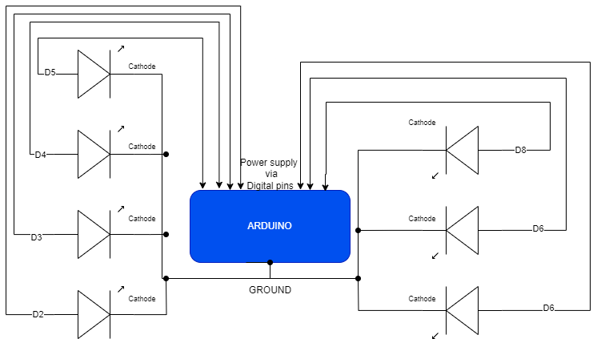

# HW11
# **Arduino Binary LED Clock**

## **Project Overview**
This project demonstrates a binary LED clock using an Arduino. The clock visually displays seconds (0–59) in binary using 6 LEDs and toggles a separate LED every minute. It is a simple yet elegant representation of time, designed for educational purposes and as a creative exploration of physical computing.

---

## **How It Works**
1. **Binary Representation**:
   - The 6 LEDs represent the seconds in binary (0–59).
   - Each LED corresponds to a bit in the binary number:
     - **LED 1** (D2): Least Significant Bit (LSB)
     - **LED 6** (D7): Most Significant Bit (MSB)
   - For example:
     - **Seconds: 12** → Binary: `001100`
       - LED 3 and LED 4 are ON.
       - All other LEDs are OFF.

2. **Minute LED**:
   - A separate LED (D8) toggles ON or OFF every minute to provide a clear visual indicator of elapsed minutes.

3. **Serial Monitor**:
   - Displays real-time updates, including:
     - Current seconds.
     - Binary representation of seconds.
     - Elapsed minutes.

---

## **Features**
- **Binary Time Representation**:
  - Visualizes time in binary format for an engaging educational experience.
- **Minute Indicator**:
  - Adds an extra dimension by tracking elapsed minutes.
- **Real-Time Debugging**:
  - Serial Monitor outputs seconds, binary values, and minutes for validation.
- **Simple Circuit Design**:
  - Uses basic components (LEDs, resistors) and an Arduino.

---

## **Components Used**
- **1 Arduino Uno (or compatible board)**
- **7 LEDs** (6 for seconds, 1 for minutes)
- **7 Resistors** (100Ω–220Ω)
- **1 Breadboard**
- **Jumper wires**

---

## **Circuit Diagram**
   
### **Schematic**

```plaintext
Arduino         Resistors           LEDs
Pin 2 --------> 180Ω Resistor ----> LED1 (Binary Bit 1)
Pin 3 --------> 180Ω Resistor ----> LED2 (Binary Bit 2)
Pin 4 --------> 180Ω Resistor ----> LED3 (Binary Bit 4)
Pin 5 --------> 180Ω Resistor ----> LED4 (Binary Bit 8)
Pin 6 --------> 180Ω Resistor ----> LED5 (Binary Bit 16)
Pin 7 --------> 180Ω Resistor ----> LED6 (Binary Bit 32)
Pin 8 --------> 180Ω Resistor ----> Minute LED

All LED Cathodes -----> GND (Ground Rail on Breadboard)
Arduino GND ----------> GND Rail
