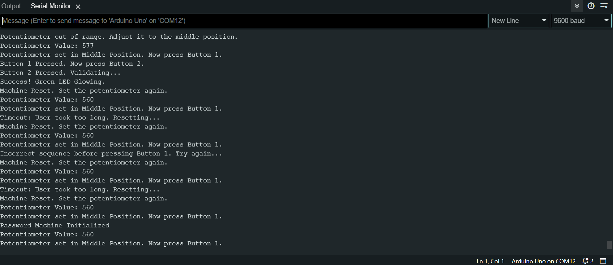

# HW12: Password Machine Using Arduino

## *Project Description*
This project implements a secure and interactive password machine using an Arduino. The machine requires the user to follow a specific sequence of actions to "unlock" the system successfully:
1. Set a potentiometer to the middle position.
2. Press Button 1.
3. Press Button 2.

If the sequence is not followed correctly (e.g., pressing Button 2 before Button 1), the system provides clear feedback by blinking the *Red LED* with printing in serial monitor as "Incorrect sequence before pressing Button 1. Try again..."  and print again in the serial monitor as "Machine Reset. Set the potentiometer again.." itself.

The system uses LEDs and the Serial Monitor to provide real-time feedback, making it user-friendly and robust.

---

## *Features*
- *Potentiometer Validation*:
  - Checks if the potentiometer is within the predefined range.
  - *Red LED* blinks if the potentiometer is out of range.
- *Button Sequence Enforcement*:
  - *Red LED blinks* if Button 2 is pressed before Button 1.
- *Timeout Functionality*:
  - Resets the system if no input is provided within 10 seconds.
- *Success and Error Feedback*:
  - *Green LED* glows for success.
  - *Red LED* blinks for errors or idle states.
- *Serial Monitor Messages*:
  - Provides step-by-step guidance and feedback to the user.

---

## *Components*
### *Input Components*:
1. *Potentiometer*: Used to set the initial value to the middle position.
2. *Button 1*: First step in the sequence.
3. *Button 2*: Second step in the sequence.

### *Output Components*:
1. *Green LED*: Lights up on successful completion of the sequence.
2. *Red LED*: Blinks during errors or idle states.

---

## *Circuit Diagram*
- *Potentiometer* connected to A0.
- *Button 1* connected to Pin 11 with a pull-up resistor.
- *Button 2* connected to Pin 12 with a pull-up resistor.
- *Green LED* connected to Pin 9.
- *Red LED* connected to Pin 10.

---

## *How to Use*
1. *Initial State*:
   - The Red LED is ON, indicating the system is idle.
   - Follow the Serial Monitor for instructions.

2. *Step 1: Set Potentiometer*:
   - Adjust the potentiometer to the middle position (within the range 450–570).
   - The system validates the potentiometer's position. If out of range, the Red LED blinks, and instructions are displayed on the Serial Monitor.

3. *Step 2: Press Button 1*:
   - Press Button 1. If Button 2 is pressed first, the Red LED blinks, and the system resets.

4. *Step 3: Press Button 2*:
   - Press Button 2. If successful, the Green LED lights up.

5. *Success*:
   - The Green LED lights up for 2 seconds, indicating success.
   - The system resets for a new sequence.

6. *Timeout*:
   - If no button is pressed within 10 seconds:
     - The Red LED blinks, and the system resets.

---

## *Code Explanation*
1. *Potentiometer Validation*:
   - Ensures the potentiometer is in the middle position before proceeding.
   - *Red LED blinks* if the potentiometer is out of range.

2. *Button Press Handling*:
   - Uses debouncing to ensure stable button readings.
   - Enforces the correct sequence:
     - *Red LED blinks* if Button 2 is pressed before Button 1.

3. *LED Indications*:
   - *Green LED*: Success.
   - *Red LED*: Blinks for errors, idle state, or potentiometer out of range.

4. *Timeout Mechanism*:
   - If no input is provided within 10 seconds, the system resets.

## Serial Monitor Output: 

## Circuit Diagram: 
